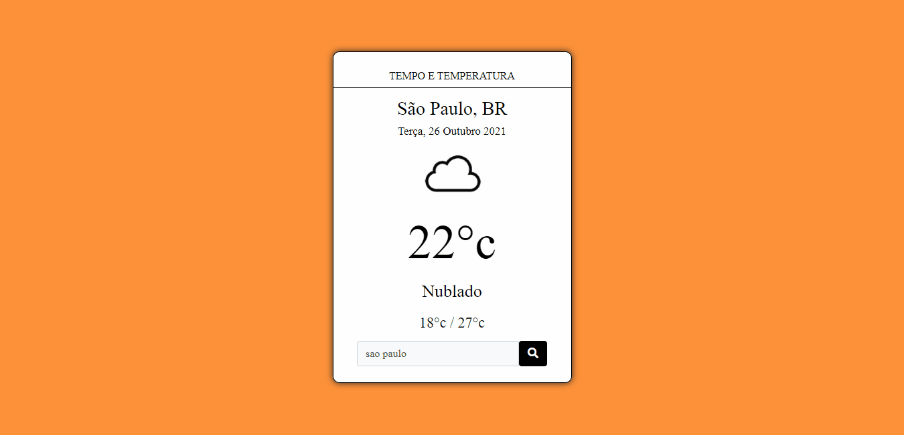
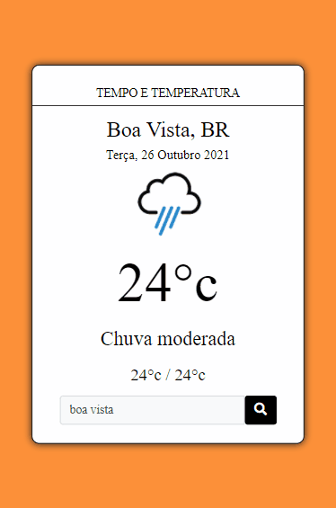

# API Clima

### Esse projeto foi desenvolvido para consumir dados de uma API!

- Foi usado o fetch para fazer o cosumo da API do Clima!
- Por meio desse projeto pode-se ver os dados de mais de 200 cidades pelo o Brasil inteiro!
- Pode-se o máximo e o mínimo do dia atual!

### Loyout para notebook e desktop

### Loyout para celulares e tablets

🚀Tecnologias usadas:
- ✔HTML
- ✔CSS
- ✔JAVASCRIPT

